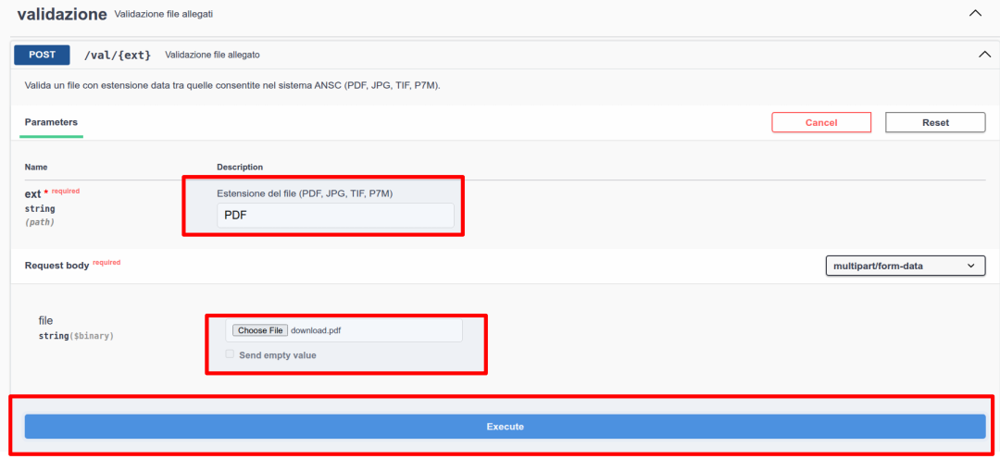

# ansc-quarkus-tool

[](CHANGELOG.md)

Tool di supporto per il progetto ANSC, al momento contiene 

1. Debug validazione allegati

## Quickstart

Requirement :

* maven 3.9.x
* java 21+

1. Avvia l'applicazione

```shell
mvn quarkus:dev
```

2. Accedi alla swagger UI

Open the [swagger-ui](http://localhost:8080/q/swagger-ui/)

## Validazione allegati

Questa funzione permette il debug degli allegati per i sistema ANSC.
Gli allegati vengono verificati in modo simile a quanto fatto dal servizio di
[Upload allegato](https://github.com/italia/ansc/blob/v1.42.2/docs/openapi/R001_allegato.yaml#L13)
Ma fornendo l'errore interno ottenuto dal servizio.

Useremo la [swagger-ui](http://localhost:8080/q/swagger-ui/) di Quarkus come interfaccia utente : 



* Inseriamo l'estensione (PDF, JPG, TIF, P7M)
* Carichiamo l'allegato
* Clicchiamo su Execute

In caso di errori otterremo una risposta del tipo : 

```json
{
  "errors": [
    {
      "code": "KO",
      "severity": "E",
      "text": "Valido?:false, Formato:PDF, Messaggio:XREF for 5:0 points to wrong object: 4:0 at offset 524969"
    }
  ],
  "valid": false
}
```

Dove nel nostro caso l'errore è *XREF for 5:0 points to wrong object: 4:0 at offset 524969*

## Risorse addizionali

[Qui](src/main/openapi/schema.yaml) puoi trovare lo schema OpenAPI.